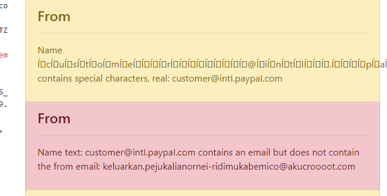
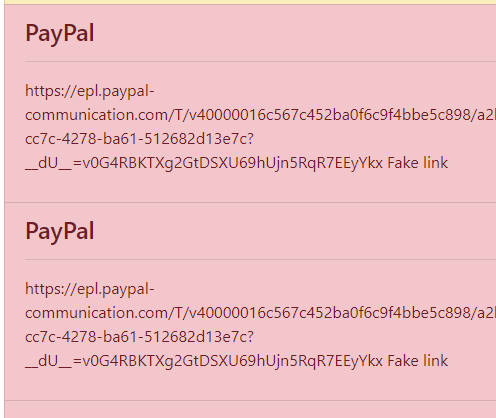

# PyWhale
Tool for detecting malicious emails and SMTP misconfiguration. Based on examples that passed the outlook email filter.


PyWhale checks for the following malicious indicators
- Obfuscated names
- Invalid From / Reply-to headers
- Domain typosquatting
- Malicious attachments (executables and office macro's)
- Zip attacks
- NTLM stealing (including PDFs)
- Common domain attacks (PayPay, Netflix, Apple, Spotify and Amazon)
- Fake links
- Obfuscated / Encoded bodies
- Mixed / Fake content-types
- Configurable JSON indicators (pywhale/indicators folder)

#### Installing
```shell script
git clone https://github.com/stefan2200/pywhale.git ; cd pywhale
python setup.py install
```

#### Usage
Run `pywhale` or `python -m pywhale`

This will spawn an interactive flask interface with API support. 
Browse to http://localhost:3333/ and enter email source code in the textbox.





##### Additional options
```
Usage: pywhale [options]

Options:
  -h, --help            show this help message and exit
  -e MAIL, --email-file=MAIL
                        The email body to parse, none will start server
  -o OUTPUT, --output-file=OUTPUT
                        File to write output to (only works with -e)
  -p PORT, --port=PORT  The port to start the server on
  -s HOST, --host=HOST  The host to start the server on (127.0.0.1 by default)

```

_Releasing because it was stashed somewhere and I'd probably forget I made it :)_